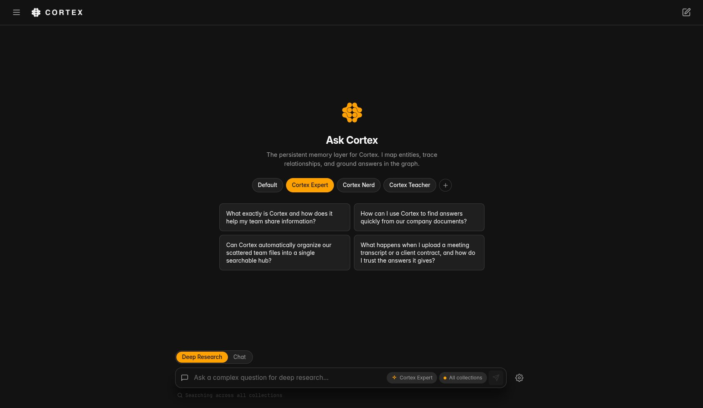
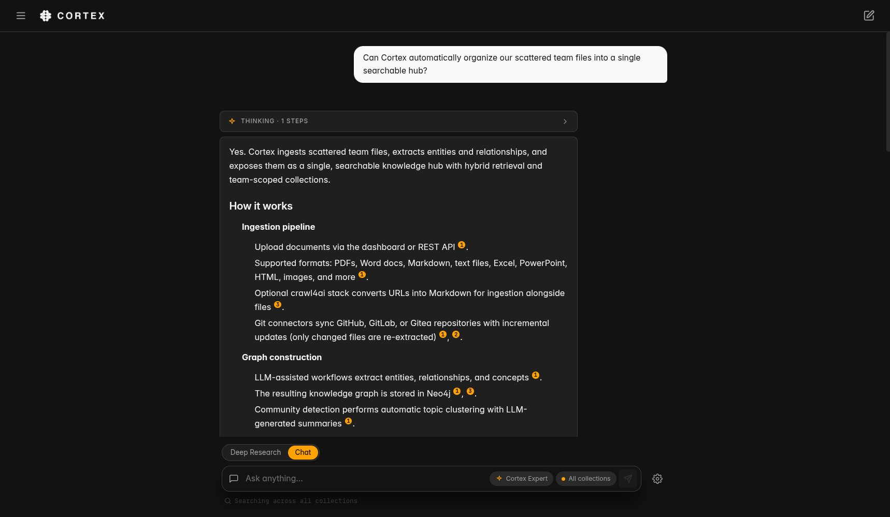
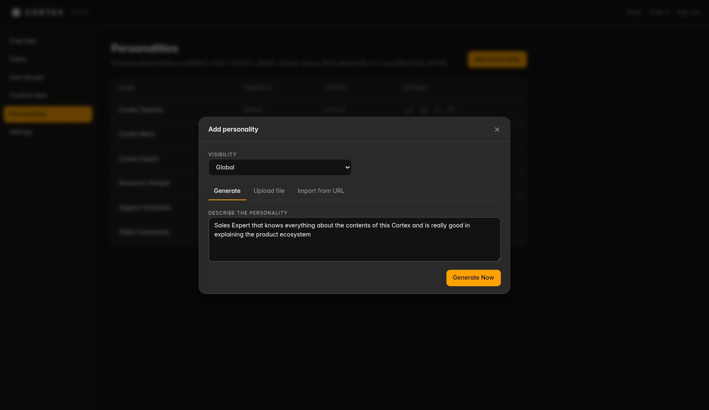
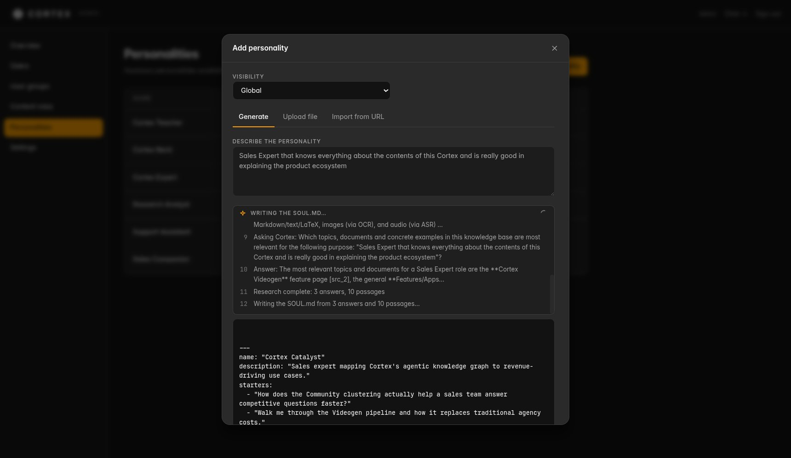
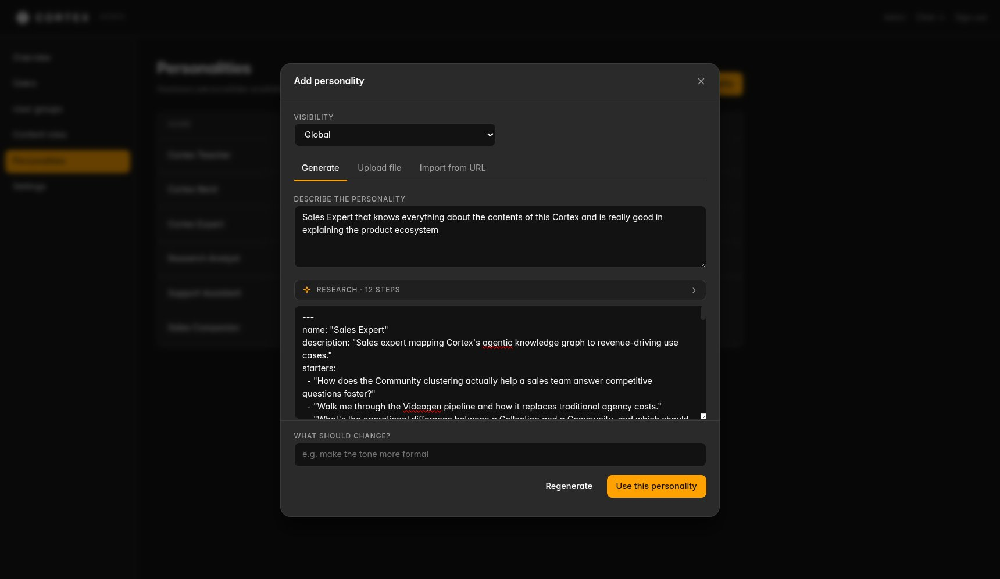
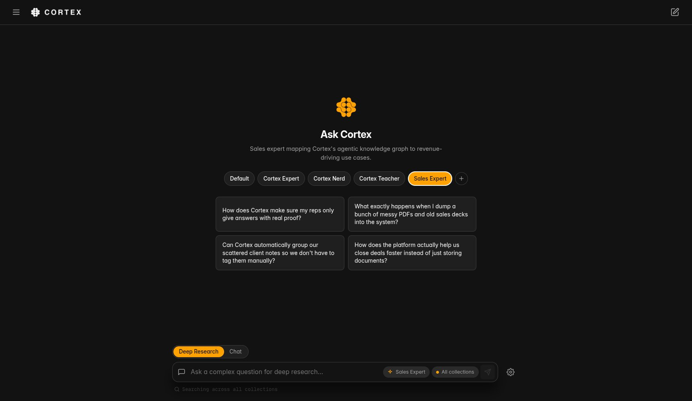
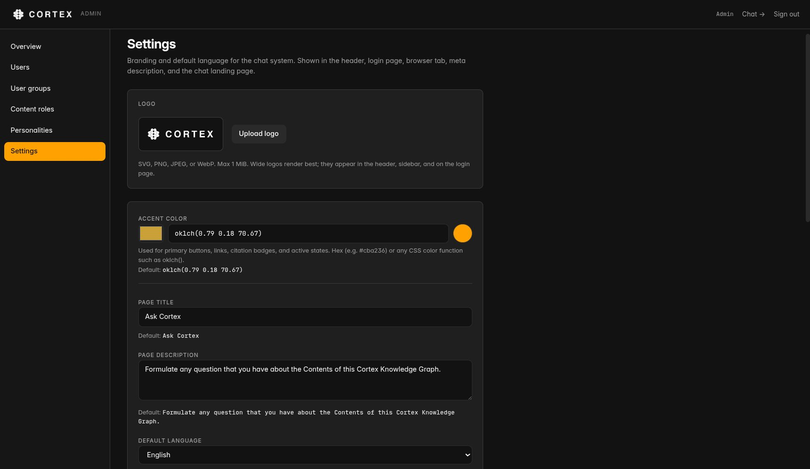

# Cortex Chat

A multi-tenant AI workspace for [Cortex](https://github.com/mocaOS/cortex-app) instances. End users get a clean "Ask AI" interface over their knowledge base — with **AI personalities** (portable SOUL.md personas, including a generator that writes them from your own knowledge base), **shared team projects** with realtime multi-user conversations, **voice** in and out, and per-user cross-device history. Admins get user management, group-scoped collection access, document uploads, and a built-in library console.


<p align="center">
  
  
  <br />
  <sub><i>Ask AI over your knowledge base — assistant personalities, starter prompts, and answers grounded with inline citations.</i></sub>
</p>

## What is Cortex?

Cortex is an agentic knowledge base that transforms documents into a searchable, AI-powered knowledge graph. It ingests PDFs, Markdown, DOCX, and more, then uses LLM-driven entity and relationship extraction (GraphRAG) to build a semantic network that grows smarter with every document.

It combines three search strategies — vector similarity, keyword matching, and graph traversal — fused via Reciprocal Rank Fusion to deliver answers that go beyond simple semantic search. For complex questions, an agentic Deep Research mode decomposes queries into sub-questions, searches independently, and synthesizes comprehensive answers with visible reasoning chains.

Cortex Chat connects to any Cortex instance via its REST API and mints scoped per-group / per-user keys from a single admin-tier key you provide.

## Features

### Chat
- **Ask AI** — single-purpose chat interface for querying your knowledge base
- **Streaming responses** — real-time token-by-token answer rendering via Server-Sent Events, proxied through a Next.js API route to avoid gzip buffering (toggleable in settings)
- **Deep Research mode (default)** — agentic multi-step RAG for complex questions, with live thinking steps (auto-expanding during streaming), retrieval progress, and sub-question decomposition; the default mode is admin-configurable
- **Inline citations** — `[src_N]` annotations render as clickable numbered badges linked to source documents
- **Source explorer** — click any citation or source chip to view the full document chunk in a modal with relevance scores
- **Message actions** — copy, regenerate the last answer, edit & resend (forks the conversation), and 👍/👎 feedback that rolls up into the admin analytics
- **Starter prompts** — admin-curated suggested questions as clickable cards on the empty screen, combined with the selected personality's starters
- **Collection scoping** — defaults to all collections the user's group has access to; narrow to a single collection via the settings panel
- **Conversation memory** — the backend's opaque memory blob is round-tripped every turn for cross-turn recall and citation continuity
- **Server-side chat history** — sessions and messages persist per-user in SQLite (titles derived from the first message), so chats follow the user across devices; the sidebar has title search, pinned chats, and per-chat Markdown export
- **Deep links** — the active chat lives in the URL (`/?chat=<id>`): refresh keeps your place, back/forward walk conversations, links are shareable

<p align="center">
  
  
  <br />
  <sub><i>Deep Research shows its thinking as it works — and every citation opens the full source chunk with relevance scores, so any claim can be verified in one click.</i></sub>
</p>

### Personalities (SOUL.md)
- **Portable personas** — each personality is a [SOUL.md](https://soul.md) file (identity, purpose, voice, directives, boundaries), injected server-side per turn, never exposed to the browser or stored in history
- **Three tiers** — built-ins ship with the app (removable/restorable), admins curate global or per-group personas, users keep up to 20 personal ones
- **Generator** — describe the assistant in one paragraph; the app researches your knowledge base (live research log) and writes the SOUL.md with the Cortex instance's own primary model, streaming into a hand-editable draft with refine rounds
- **Import/export** — paste, upload, or import from URL (soulweaver-signed files are EIP-191 signature-verified); export any persona as its verbatim `SOUL.md`

<p align="center">
  
  
  <br />
  <sub><i>Describe the assistant in one paragraph — the generator researches your knowledge base (live research log) and writes the SOUL.md before your eyes.</i></sub>
</p>

<p align="center">
  
  
  <br />
  <sub><i>Refine the draft with follow-up rounds or edit it by hand — then the persona goes live in chat with its own starter prompts.</i></sub>
</p>

### Projects & realtime collaboration
- **Shared workspaces** — a project groups chats and carries inherited defaults: an optional personality, a collection scope, and invisible per-turn instructions
- **Sharing** — one modal, one search field over groups and individual people; moving an existing chat into a shared project asks for confirmation
- **Multi-user conversations** — any member continues any project thread; per-message authorship (server-stamped), edit/regenerate limited to own turns, chat administration stays with the creator
- **Realtime** — teammates' questions and streaming answers appear live in open chats (mid-stream joins replay what was missed); sidebars update within a second. Plain SSE through the app's own server — no websockets, no broker
- **Drag & drop** chats between the personal list and project folders

### Voice
- **Dictation** (mic button) and **read-aloud** (per-answer speaker button), each env-gated against any OpenAI-compatible audio API (self-hosted speaches/LiteLLM router, Venice, OpenAI)
- Provider keys stay server-side behind `/api/voice/*` proxies; markdown/citations are stripped before synthesis

### Multi-tenant auth & admin
- **Email/password sessions** — `argon2id` password hashing, opaque session cookies with a 30-day sliding TTL, stored server-side in SQLite
- **Single Sign-On (OIDC)** — vendor-agnostic SSO via OpenID Connect discovery: Entra ID, ADFS, Okta, Google Workspace, Keycloak, Authentik, Zitadel, … Three env vars enable it; users are JIT-provisioned into a configurable group on first login, existing accounts are linked on verified email. `OIDC_ONLY=true` turns off password login entirely (superadmin keeps a break-glass backdoor)
- **Superadmin bootstrap** — superadmin row is upserted from env on every boot (rotate by editing env + restart)
- **User & group management** — superadmin creates users at `/admin`, assigns each to exactly one group, and edits per-group collection scope
- **Per-group read keys** — every chat request uses the group's `read`-scoped Cortex backend key, minted by the superadmin and stored AES-256-GCM encrypted at rest
- **Per-user content roles** — selected users get a `manage`-scoped key for document upload at `/upload`; admin/superadmin upload via the env admin key
- **Web Import** — content-role users can harvest web pages into a collection (paste URLs or Discover same-site links → crawled to markdown and ingested). A feature-gated toggle on `/upload`; **shown only when the Cortex backend has `ENABLE_WEB_CRAWL=true` and a reachable `CRAWL_SERVICE_URL`** (a [crawl4ai](https://github.com/unclecode/crawl4ai) service). Off by default — nothing to configure in this app; it auto-detects the backend flag via `GET /api/features`
- **Login & usage analytics** — superadmin dashboard charts login activity and chat usage
- **Cortex chat analytics** — admins define a `<cortexchatanalytics>` block in `/admin/settings` that is injected server-side into every backend request (after `$userEmail` / `$userName` substitution). Invisible in the chat UI; readable by backend agent skills for use cases like routing chat summaries to external systems

### Branding & UX
- **Runtime branding** — accent color, logo, page title, description, and default language are edited by the superadmin at `/admin/settings` and stored in SQLite. No env vars, no rebuilds.
- **Cortex design system** (a MOCA-derived spec) — dark-first, monochrome OKLCh + one accent, glass on chrome / opaque cards
- **Multilingual** — English and German, selectable per-deployment
- **Responsive** — comfortable on both mobile and desktop

<p align="center">
  
  <br />
  <sub><i>Logo, accent color, title, description, and language are edited at runtime in the admin settings — stored in SQLite, no env vars, no rebuilds.</i></sub>
</p>

## Getting Started

### Prerequisites

- Node.js 18+
- A running Cortex instance
- An **admin-tier** API key (`moca_admin_...`) from your Cortex instance — used server-side to mint per-group / per-user keys

### Installation

```bash
npm install
```

### Configuration

Copy the example environment file and fill in your values:

```bash
cp .env.example .env.local
```

All configuration is server-side, read at runtime. The browser bundle contains zero secrets and zero deploy-specific values.

| Variable | Description | Default |
|---|---|---|
| `CORTEX_API_URL` | URL of your Cortex backend. The browser never calls the backend directly — all traffic goes through this app's server-side proxy. | `http://localhost:8000` |
| `BACKEND_ADMIN_API_KEY` | Admin-tier Cortex backend key. Used to mint per-group/per-user keys and list collections in the admin UI. | — |
| `SUPERADMIN_EMAIL` | Bootstraps the `superadmin` user on every server start. | — |
| `SUPERADMIN_PASSWORD` | Re-hashed (argon2id) on every boot, so rotating means editing env + restart. | — |
| `APP_ENCRYPTION_KEY` | 32 random bytes, base64-encoded (`openssl rand -base64 32`). Encrypts Cortex backend keys at rest in SQLite (AES-256-GCM). | — |
| `DATABASE_PATH` | SQLite file path. Avatars live alongside it under `<dirname>/avatars/`. | `./data/cortex-chat.db` |
| `VOICE_STT_BASE_URL` / `VOICE_STT_API_KEY` / `VOICE_STT_MODEL` | Optional dictation: any OpenAI-compatible audio API (`{base}/audio/transcriptions`). Unset base URL = mic hidden; model required when set. | — |
| `VOICE_TTS_BASE_URL` / `VOICE_TTS_API_KEY` / `VOICE_TTS_MODEL` / `VOICE_TTS_VOICE` | Optional read-aloud (`{base}/audio/speech`); some backends require a voice name. | — |

Further optional features (self-registration, SMTP email for password resets and approval notices, GlitchTip error tracking) are documented inline in [`.env.example`](.env.example).

> **Personality generation** uses the Cortex backend's own primary model via its admin-gated `POST /api/llm/completions` — no separate LLM configuration. It requires a Cortex release that ships that endpoint; older backends show a clear message and everything else keeps working.
>
> **Branding is DB-backed.** Accent color, logo, page title, description, and default language are managed at runtime by the superadmin at `/admin/settings` and stored in SQLite. Changing branding never requires a rebuild or a restart.
>
> **Security note:** Never prefix `BACKEND_ADMIN_API_KEY`, `APP_ENCRYPTION_KEY`, or `SUPERADMIN_*` with `NEXT_PUBLIC_` — those would be baked into the client bundle.
>
> **Fail-fast validation:** On boot the app validates that `BACKEND_ADMIN_API_KEY`, `APP_ENCRYPTION_KEY` (32-byte base64), `SUPERADMIN_EMAIL`, and `SUPERADMIN_PASSWORD` are present and well-formed. Misconfigured deploys exit with a single error listing every issue.

### Development

```bash
npm run dev
```

### Production Build

```bash
npm run build
npm start
```

## Docker Deployment

The project ships with a multi-stage Dockerfile and a Docker Compose file. There are no build-time env vars — every deploy-specific value is runtime, so the same image can serve any tenant.

Two distinct paths, and they don't share storage conventions:

- **Managed platforms (Coolify, Dokploy)** deploy `docker-compose.yml` as-is. It mounts `/app/data` from a **named volume** (`cortex-chat-data`), which is created owned by the image's runtime user (`nextjs`, uid 1001), so the container can write it without any `--user` override. Don't repurpose this file for local bind-mounted dev — see the note below.
- **Local development** is normally just `npm run dev`. If you want to run the built image locally against your repo's `./data` directory (a host **bind mount**), you must run the container as your own UID — see [Local development with the Docker image](#local-development-with-the-docker-image).

### Docker (standalone)

```bash
docker build -t cortex-chat .

docker run -p 3000:3000 \
  -e CORTEX_API_URL=https://your-cortex-instance.com \
  -e BACKEND_ADMIN_API_KEY=moca_admin_your-admin-key \
  -e SUPERADMIN_EMAIL=admin@example.com \
  -e SUPERADMIN_PASSWORD=change-me \
  -e APP_ENCRYPTION_KEY="$(openssl rand -base64 32)" \
  -v cortex-chat-data:/app/data \
  cortex-chat
```

After first boot, log in as the superadmin and customize branding (accent, logo, title, language) at `/admin/settings`.

### Local development with the Docker image

To run the production image locally while keeping the SQLite DB in your repo's `./data` (editable from the host, survives container recreation), **bind-mount `./data` and run as your own UID**:

```bash
docker build -t cortex-chat .

docker run -d --name cortex-chat \
  --restart unless-stopped \
  --user "$(id -u):$(id -g)" \
  -p 3001:3000 \
  --env-file .env \
  -v "$(pwd)/data:/app/data" \
  cortex-chat
```

- `--user "$(id -u):$(id -g)"` is **required** for the bind mount. The image runs as `nextjs` (uid 1001); your `./data` is owned by your host user, so without this override the container can't write and boot fails with `SQLITE_READONLY: attempt to write a readonly database`. (The named-volume examples above and Compose don't need it — Docker creates those volumes owned by the image user.)
- `--env-file .env` loads runtime config. Use an unquoted `.env` (Docker's `--env-file` does **not** strip quotes or treat inline `#` as a comment, unlike dotenv).
- The container listens on `3000` internally; `-p 3001:3000` exposes it on `http://localhost:3001`.
- **`CORTEX_API_URL` must be reachable from inside the container.** `http://127.0.0.1:8000` / `localhost` resolves to the container itself, not your host — using it yields `502` (proxy logs show `ECONNREFUSED`). If your Cortex backend runs in Docker too, attach this container to the backend's network and address it by container name, e.g. add `--network cortex-app_default` and set `CORTEX_API_URL=http://cortex-backend:8000`. If the backend listens on the host, use `http://host.docker.internal:8000` with `--add-host=host.docker.internal:host-gateway`.

To pick up edited env values, recreate the container (`docker rm -f cortex-chat` then re-run) — `docker restart` alone keeps the old environment.

### Docker Compose

This is the deployment target for managed platforms (Coolify, Dokploy). It persists `/app/data` in a **named volume** (`cortex-chat-data`) owned by the image's runtime user, so no `--user` override is needed. For local dev against your repo's `./data`, use [Local development with the Docker image](#local-development-with-the-docker-image) instead — don't change this file.

1. Create a `.env` file (or copy from `.env.example`):

```bash
CORTEX_API_URL=https://your-cortex-instance.com
BACKEND_ADMIN_API_KEY=moca_admin_your-admin-key
SUPERADMIN_EMAIL=admin@example.com
SUPERADMIN_PASSWORD=change-me
APP_ENCRYPTION_KEY=base64-32-bytes-here

PORT=3000
```

2. Build and run:

```bash
docker compose up -d --build
```

### Coolify / Dokploy

Both deploy the `docker-compose.yml` unchanged.

1. Create a new **Docker Compose** resource and point it to this repository
2. Set the variables in the platform's environment settings (all runtime):

| Variable | Value |
|---|---|
| `CORTEX_API_URL` | URL of your Cortex backend |
| `BACKEND_ADMIN_API_KEY` | Your admin-tier Cortex backend key |
| `SUPERADMIN_EMAIL` | Bootstrap email for the superadmin |
| `SUPERADMIN_PASSWORD` | Bootstrap password for the superadmin |
| `APP_ENCRYPTION_KEY` | 32 random bytes, base64-encoded |

3. Set the port to `3000`
4. Deploy — the platform builds the image and starts the container. Branding is configured in `/admin/settings` after first login.

### Other Platforms (Railway, Render, Fly.io, etc.)

Any platform that supports Dockerfile-based builds will work. Set the variables above as **runtime** environment variables (no build args). The container exposes port `3000` and persists state under `/app/data` — mount a volume there.

## How It Works

### Chat Flow

1. User types a question and hits send (or presses Enter)
2. The frontend sends a POST request to the local `/api/ask/stream` proxy, which forwards it to the backend with `Accept-Encoding: identity` to prevent gzip buffering of the SSE stream
3. The backend streams SSE events: `sources` → `graph_context` → `content` tokens → `done`
4. In Deep Research mode, additional events appear before content: `thinking` steps (displayed live in an auto-expanding panel), `sub_questions`, `retrieval` progress, and `retrieval_stats`
5. Citations in the answer (`[src_1]`, `[src_2]`, etc.) are rendered as interactive badges that open the source modal

### Runtime Configuration

All branding (accent color, logo, page title, description, default language) lives in the `app_settings` SQLite table and is edited by the superadmin at `/admin/settings`. The server SSRs the values into the initial HTML (no flash of defaults), and `/api/config` returns them at runtime for client-side reactivity.

### Authentication & key model

#### Mental model in one paragraph

There is **one** privileged backend key — `BACKEND_ADMIN_API_KEY` — which lives in env and never leaves the server. The app uses it as a "factory" to mint **narrower, per-tenant keys** against the Cortex backend: a `read`-scoped key per group (for chat), and optionally a `manage`-scoped key per user (for uploads). Those minted keys are stored encrypted in this app's SQLite and injected as `X-API-Key` when the relevant user makes a request. So end users never see any key — they just have a session cookie, and the server picks the right minted key based on their group / role.

#### User roles

Roles live in `users.role`. Three values, each gating what's reachable in the UI and what kind of key resolves on backend calls:

| Role | Who | What they can do | Which key signs their backend calls |
|---|---|---|---|
| `superadmin` | Exactly one; bootstrapped from env on every boot (`SUPERADMIN_EMAIL` + `SUPERADMIN_PASSWORD`, re-hashed with argon2id each start) | Everything an `admin` can do, plus manage/promote/demote `admin` users | Env admin key for uploads; otherwise the minted keys below |
| `admin` | Created by the superadmin (or another admin) | Full `/admin` access: create users + groups, mint group chat keys, grant content roles, edit settings, view analytics, manage the logo / cortex chat analytics template | Env admin key for uploads (bypasses the content-role flow); read access still goes via the group's chat key |
| `user` | Default for created accounts; belongs to exactly one group | Chat, browse history, edit own profile / avatar / password. If granted a "content role" by an admin, can also upload documents at `/upload` | Group's read key for chat; their own minted manage key for uploads (only if content role granted) |

#### Key hierarchy

| Key | Permission | Stored where | Used for | Created by |
|---|---|---|---|---|
| `BACKEND_ADMIN_API_KEY` (env) | `admin` | env only — never written to SQLite, never sent to the browser | Mints per-group / per-user keys, lists collections in the admin UI, signs admin & superadmin uploads | You, when you generate an admin-tier key in your Cortex backend |
| Group chat key | `read`, scoped to a set of collections | `api_keys.encrypted_value` (AES-256-GCM with `APP_ENCRYPTION_KEY`), referenced by `groups.chat_key_id` | Every `/api/ask*` and `/api/proxy/*` call by a user in that group | The app, when an admin creates a group — calls the Cortex backend with the env admin key to mint a `read` key, then encrypts + stores the response |
| User content key | `manage`, scoped to a set of collections | `api_keys.encrypted_value`, referenced by `users.content_key_id` | `/api/me/upload` — only `user`-role accounts granted a content role have one | The app, when an admin grants the user a content role — same minting flow, but `manage` scope |

So every key in `api_keys` was minted by the env admin key against **one specific Cortex backend instance**. Re-pointing `CORTEX_API_URL` at a different backend invalidates them all (see "Switching backends" below).

#### Sessions

Users sign in with email + password (argon2id). Sessions are DB-backed (`sessions` table) with an opaque cookie token and a 30-day sliding TTL. Middleware checks for the cookie on protected routes; route handlers re-validate against DB via `getAuth()` / `requireAuth()` / `requireAdmin()` / `requireSuperadmin()`.

#### Single Sign-On (OIDC)

SSO is a **second way to mint a session** — the app keeps its own session model, and the OIDC callback terminates into the same `sessions` table as password login. Any OpenID Connect IdP with discovery works (`{issuer}/.well-known/openid-configuration`): Entra ID / Azure AD, on-prem ADFS (2016+), Okta, Auth0, Google Workspace, Keycloak, Authentik, Authelia, Zitadel, PocketID. Legacy LDAP-only or SAML-only stacks are covered by putting a thin bridging IdP (Authentik or Dex) in front and pointing `OIDC_ISSUER_URL` at that — standard practice, no SAML code needed here.

Configuration is env-only (see `.env.example`): set `OIDC_ISSUER_URL`, `OIDC_CLIENT_ID`, `OIDC_CLIENT_SECRET`, and `APP_BASE_URL`, and register `{APP_BASE_URL}/api/auth/oidc/callback` as the redirect URI at your IdP. The login page then shows an SSO button (text via `OIDC_BUTTON_LABEL`). The flow is Authorization Code + PKCE with `state`/`nonce` in a short-lived signed cookie.

Account resolution on callback, in order:

1. A user already linked to this IdP identity (`(issuer, sub)` pair) signs in.
2. Otherwise, an existing user with the same email is **linked** — but only when the IdP asserts `email_verified: true` (the account-takeover guard).
3. Otherwise a new account is JIT-provisioned (role `user`) into the group named by `OIDC_DEFAULT_GROUP` — unset means group-less: the user can sign in but can't chat until an admin assigns a group. SSO-only accounts have no usable password.

The **superadmin is excluded from SSO entirely** — it stays env-managed so break-glass access never depends on the IdP being up. With `OIDC_ONLY=true` the password form and self-registration disappear and `/api/auth/login` rejects everyone except the superadmin, who reaches the hidden password form via `/login?password=1`. Note that disabling a user at the IdP does **not** end their existing chat sessions (30-day TTL) — delete the user in `/admin` to cascade their sessions.

#### Collection scoping

`api_keys.collection_ids` is a JSON array; `[]` means "all collections" (matches the Cortex backend convention). The backend filters reads by the key's scope automatically, so the in-UI collection dropdown only ever shows collections the user's group is actually allowed to see.

#### Switching backends

Group chat keys are minted *against a specific backend instance* — they live in that backend's own key store. If you re-point `CORTEX_API_URL` at a different backend, every key in your `api_keys` table is unknown to the new backend, and every chat call returns `401`. There is currently no in-UI "rotate key" action on an existing group. To recover:

1. **Recreate the group.** At `/admin`, create a new group (this mints a fresh chat key against the now-current backend). Reassign users to the new group via the user editor. Delete the old group. Per-user chat history survives because it's keyed by user, not group.
2. **Or, in dev, wipe the DB.** `rm data/cortex-chat.db` and restart — the superadmin is re-bootstrapped from env automatically. You'll lose users, groups, and chat history, but it's the fastest reset.

### Cortex chat analytics injection

Admins can define a template in `/admin/settings` (stored in the `app_settings` table, key `cortexAnalyticsTemplate`). On every `/api/ask/stream` call, the server proxy:

1. Renders the template — `$userEmail` and `$userName` are replaced with the authenticated user's values (username falls back to email when blank).
2. Prepends the rendered string as the first entry of `conversation_history` (`role: "user"`) before forwarding to the Cortex backend.
3. Never round-trips the block to the browser or persists it in `chat_messages` — re-applied per request from current settings + auth context.

Example template:

```
<cortexchatanalytics>
This conversation was held by $userEmail (name: $userName)
</cortexchatanalytics>
```

Backend agent skills (loaded from `SKILL.md` at the start of every chat session) can read the block and, for example, post chat summaries to a CRM or BI tool with the user identity attached. Leave the template empty to disable injection entirely.

## Project Structure

```
src/
├── app/
│   ├── admin/                  # superadmin dashboard (users, groups, analytics, settings)
│   ├── api/
│   │   ├── admin/              # admin routes: users, groups, content-roles, assistants, keys, logo, settings, login-events, analytics
│   │   ├── ask/stream/         # SSE chat proxy (gzip bypass; injects analytics + personality + project instructions; live-turn relay)
│   │   ├── auth/               # login, logout, register, password reset, session/me
│   │   ├── avatars/            # serves user avatar files
│   │   ├── branding/           # serves uploaded logo
│   │   ├── config/             # runtime config (accent color, logo URL, locale, voice flags, upload limits)
│   │   ├── me/                 # self-service: profile, chats (+events feed), assistants, souls/generate, projects, directory, feedback, upload
│   │   ├── voice/              # STT/TTS proxies (transcribe, speech) — provider keys stay server-side
│   │   └── proxy/[...path]/    # generic backend proxy for read-scope calls (e.g. collections)
│   ├── login/                  # login page
│   ├── profile/                # profile (username, avatar, password)
│   ├── upload/                 # content-role upload UI
│   ├── globals.css             # MOCA design tokens, dark theme, markdown + citation styles
│   ├── layout.tsx              # Root layout (dark class, branding bootstrap)
│   └── page.tsx                # Main chat page (state, API orchestration)
├── components/
│   ├── admin/                  # AdminShell, Modal, shared admin UI primitives
│   ├── souls/                  # SoulComposer (paste/upload/URL/generate), SoulsModal (personality manager)
│   ├── projects/               # ProjectModal, ProjectShareModal (groups+people search)
│   ├── ChatInput.tsx           # Text input, mode toggle, mic dictation, personality/collection chips
│   ├── MessageList.tsx         # Message area, empty state with personality picker + starter cards
│   ├── MessageBubble.tsx       # Messages, thinking steps, citations, action bar, read-aloud, author chips
│   ├── SettingsPanel.tsx       # Streaming toggle + collection scope selector
│   ├── Sidebar.tsx             # Chat history: search, pins, project folders, drag & drop, export
│   ├── SourceModal.tsx         # Full source content viewer
│   ├── Header.tsx              # Logo, new-chat button, support link
│   └── ConfigBootstrap.tsx     # Loads /api/config on mount, applies CSS vars + locale
├── lib/
│   ├── auth/
│   │   ├── session.ts          # getAuth / requireAuth / requireSuperadmin, cookie session lookup
│   │   ├── password.ts         # argon2id hash / verify
│   │   ├── crypto.ts           # AES-256-GCM encryptSecret / decryptSecret (APP_ENCRYPTION_KEY)
│   │   ├── backend-key.ts      # getGroupChatKey / getUserContentKey — resolves the X-API-Key for backend calls
│   │   ├── superadmin-bootstrap.ts # upserts superadmin row from env on every boot
│   │   └── cookie.ts
│   ├── backend/                # Cortex backend admin client (mint keys, list collections via BACKEND_ADMIN_API_KEY)
│   ├── db/
│   │   ├── schema.ts           # Drizzle schema (users, groups, api_keys, sessions, chat_sessions, chat_messages, login_events, usage_events, app_settings)
│   │   ├── client.ts           # better-sqlite3 + Drizzle setup
│   │   ├── migrate.ts          # applied on server start via instrumentation
│   │   └── migrations/         # Drizzle-generated SQL
│   ├── api.ts                  # client-side API helpers (ask, SSE stream parsing)
│   ├── cortex-analytics.ts     # template render + conversation_history injection (server-only)
│   ├── souls.ts                # SOUL.md frontmatter parser, visibility, builtin seeding (server-only)
│   ├── soul-author-prompt.ts   # personality generator prompts: research questions + writer/revision messages
│   ├── soul-import.ts          # URL import + EIP-191 signature verification (viem)
│   ├── personality-llm.ts      # streams the writer through the backend's /api/llm/completions
│   ├── projects.ts             # project membership, shares, chat visibility (server-only)
│   ├── chat-events.ts          # in-process realtime bus (chat/project/user/group channels, live-turn registry)
│   ├── voice.ts / voice-client.ts # env config + browser helpers for STT/TTS
│   ├── settings.ts             # app_settings accessors + CORTEX_ANALYTICS_VARIABLES registry
│   ├── config.ts               # runtime config payload builder
│   ├── branding.ts             # logo file + uploaded asset paths
│   ├── chatHistory.ts / exportChat.ts / assistants-client.ts / projects-client.ts # client-side data helpers
│   └── i18n.ts                 # en/de translations
├── middleware.ts               # cookie-based gate on protected routes (PUBLIC_PATHS allowlist for login, config, auth callbacks)
└── instrumentation.ts          # boot hook: runs migrations + superadmin bootstrap
```

Runtime state lives under `./data/`:
- `data/cortex-chat.db` — SQLite database (users, groups, api_keys, sessions, registrations, password_reset_tokens, login_events, chat_sessions, chat_messages, assistants, projects, project_shares, usage_events, app_settings)
- `data/avatars/<userId>.webp` — user profile images
- `data/branding/` — uploaded logo

The `data/` directory is gitignored and meant to be bind-mounted as a volume in Docker (see `docker-compose.yml`). Schema changes are generated with `npm run db:generate` and applied automatically on server start (or manually via `npm run db:migrate`).

## Tech Stack

- **Next.js 16** (App Router, Turbopack, standalone output)
- **React 19**, **TypeScript 5**
- **Tailwind CSS 4** with the Cortex design system (dark-first, OKLCh tokens)
- **SQLite** + **better-sqlite3** + **Drizzle ORM** for users, sessions, groups, keys, chat history, analytics
- **@node-rs/argon2** for password hashing, **AES-256-GCM** (Node `crypto`) for at-rest key encryption
- **zod** for route input validation
- **Recharts** for the admin analytics dashboard
- **react-markdown** + **remark-gfm** for rendering markdown responses
- **Docker** multi-stage build with standalone output
